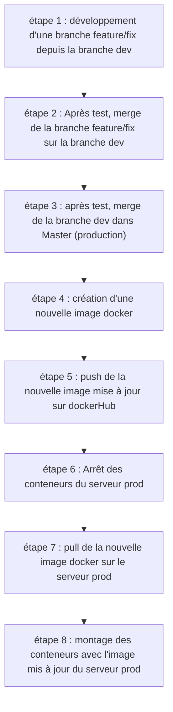

# CI/CD

```mermaid
graph TD
  A[" étape 1 : développement d'une branche feature/fix depuis la branche dev"]-->B["étape 2 : Après test, merge de la branche feature/fix sur la branche dev"]-->C["étape 3 : après test, merge de la branche dev dans Master (production)"]-->D["étape 4 : création d'une nouvelle image docker"]-->E["étape 5 : push de la nouvelle image mise à jour sur dockerHub"]-->F["étape 6 : Arrêt des conteneurs du serveur prod"]-->G["étape 7 : pull de la nouvelle image docker sur le serveur prod"]-->H["étape 8 : montage des conteneurs avec l'image mis à jour du serveur prod"]
```
