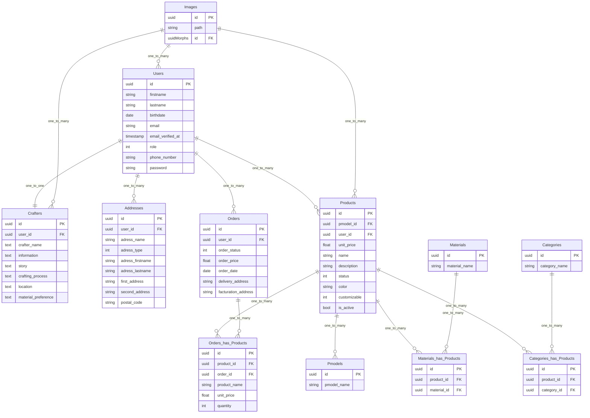

# CraftedByDB

```mermaid
erDiagram
  Users ||--|| Crafters : one_to_one
  Users ||--o{ Addresses : one_to_many
  Users ||--o{ Orders : one_to_many
  Users ||--o{ Products : one_to_many
  Users {
    uuid id PK
    string firstname
    string lastname
    date birthdate
    string email
    timestamp email_verified_at
    int role
    string phone_number
    string password
  }
  Crafters {
    uuid id PK
    uuid user_id FK
    text crafter_name
    text information
    text story
    text crafting_process
    text location
    text material_preference
  }
  Addresses {
    uuid id PK
    uuid user_id FK
    string adress_name
    int adress_type
    string adress_firstname
    string adress_lastname
    string first_address
    string second_address
    string postal_code
  }
    Pmodels {
    uuid id PK
    string pmodel_name
  }
  Products ||--o{ Orders_has_Products : one_to_many
  Products ||--o{ Pmodels : one_to_many
  Products ||--o{ Materials_has_Products : one_to_many
  Products ||--o{ Categories_has_Products : one_to_many
  Products {
    uuid id PK
    uuid pmodel_id FK
    uuid user_id FK
    float unit_price
    string name
    string description
    int status
    string color
    int customizable
    bool is_active
  }
  Categories ||--o{ Categories_has_Products : one_to_many
  Categories {
    uuid id PK
    string category_name
  }
  Materials ||--o{ Materials_has_Products : one_to_many
  Materials {
    uuid id PK
    string material_name
  }
  Orders ||--o{ Orders_has_Products : one_to_many
  Orders {
    uuid id PK
    uuid user_id FK
    int order_status
    float order_price
    date order_date
    string delivery_address
    string facturation_address
  }
  Orders_has_Products {
    uuid id PK
    uuid product_id FK
    uuid order_id FK
    string product_name
    float unit_price
    int quantity
  }
  Categories_has_Products {
    uuid id PK
    uuid product_id FK
    uuid category_id FK
  }
  Materials_has_Products {
    uuid id PK
    uuid product_id FK
    uuid material_id FK
  }
  Images ||--o{Products : one_to_many
  Images ||--o{Crafters : one_to_many
  Images ||--o{Users : one_to_many
  Images {
    uuid id PK
    string path
    uuidMorphs id FK
  }
```
